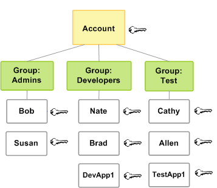

# aws-create-user

## Descrição
Criar multiplos usuários na AWS usando o aws cli e uma planilha csv.

## Usuários criados

## Referência
[AWS IAM](https://docs.aws.amazon.com/pt_br/IAM/latest/UserGuide/introduction_access-management.html)
